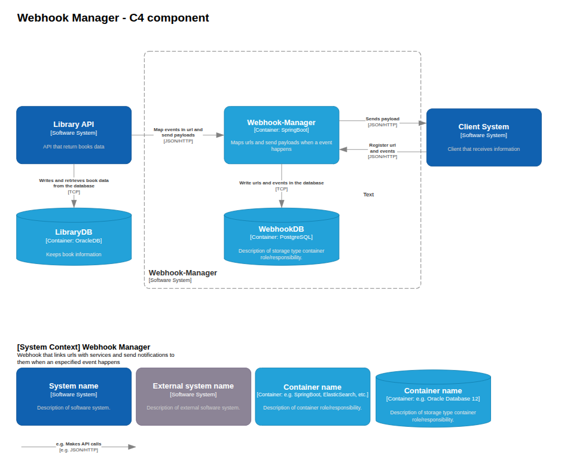

## Webhook Manager

A centralized webhook system that allows services to emit events and clients to subscribe URLs to those events, automatically delivering payloads when events occur.

## How It Works

### Client Side (Consumers)

Clients register:
- A **URL endpoint**
- One or more **events** they want to receive

When a subscribed event occurs, the Webhook Manager sends the corresponding payload to the registered URL.

---

### Server Side (Event Producers)

Services register themselves with the Webhook Manager by providing:
- Their **service URL**
- The **event name(s)** they can emit

When an event occurs, the service notifies the Webhook Manager with the event data.

---

### Webhook Manager Responsibilities

- Maintain a mapping between **events** and **subscribed client URLs**
- Receive event notifications from **producer services**
- Dispatch payloads to **all client URLs subscribed** to the triggered event

## Diagram

## Use Cases

- Notify clients when a new event occurs (e.g., user registration, order creation, system alert)
- Deliver payloads to multiple subscribed endpoints automatically
- Enable services to broadcast events without knowing the consumers
- Track and monitor event deliveries and failures for auditing purposes
- Can be extended to any domain where event-driven notifications are required

## Set-up
git clone https://github.com/Gabriel-Gerhardt/Webhook-Manager.git
cd Webhook-Manager
docker-compose up

Access:

    User: http://localhost:8100
    Library: http://localhost:8080
    Manager: http://localhost:9000

## Contact

